## 安装

```bash
$ yarn
```
<div style="
  color: yellow;
  margin: 20px 0;
">提示: Node 版本 >= 16.0.0</div>

## 跑起来

```bash
# 本地测试 node 环境
$ npm run start:dev
```

## 编译

```bash
# 编译 directus 下的 endpoints 扩展
$ npm run zx:start
```

## 安装模块 

```bash
# 会自动在 src 目录下安装 services、module、controller
$ npm run g:m
```

## 说明

### 本项目主要目的：
 1. 为了解决 `directus` 的扩展接口无法在本地调试问题;
 2. 为了解决 `directus` 的扩展接口无法通用问题;
 3. 为了解决 `directus` 的扩展接口结构混乱问题;

为了解决 `问题1`，我们使用 [Nest](https://github.com/nestjs/nest) 框架在 `node` 端进行本地调试。<br /> 
为了解决 `问题2`，我们将 `directus` 扩展在 `Nest` 框架内部进行管理，将通用的接口封装在每个模块内部，然后将其暴露出去。
<br /> 
为了解决 `问题3`，我们使用 [Knex](https://github.com/knex/knex) 库，在前端使用 [ORM](https://zh.wikipedia.org/wiki/%E5%AF%B9%E8%B1%A1%E5%85%B3%E7%B3%BB%E6%98%A0%E5%B0%84) 语法代替原始的 `Mysql` 语法。实际上，除了使用 `Knex` 还是不够的，因为我们没有办法在前端建立数据库模型，在使用 ORM 语法的时候，还存在类型安全的问题，所以我们引入了类型版的 `Knex`，它是 [typed-knex](https://github.com/wwwouter/typed-knex)，利用 TypeScript ，它能够在前端建立安全的数据表模型，然后安全地进行 `Query`。类似的知名开源工具有 [TypeOrm](https://github.com/typeorm/typeorm/)，想了解相关的概念，请参考：https://typeorm.bootcss.com/
<br /> 

# 目录结构

<div style="margin-top: 20px">
  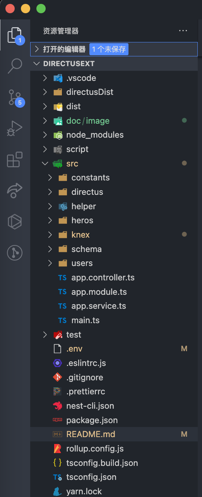
</div>

 <br />

我们只需要关注其中几个关键文件夹和文件，所以只需知道几个 `重点` 作用即可。

`directusDist`:
  介绍：为 `directus` 扩展打包后的目录；运行命令：`yarn zx:start` 之后可以生成该目录。

`script`:
  介绍：用来放置 node 的扩展脚本，然后在 `package.json` 里的 `scripts` 编写对应的命令执行。

`src`:
  介绍：为日后开发的主要目录。

`.env`:
  介绍：用来配置服务器参数。<br />
  `DB_CLIENT`: 数据库类型 <br />
  `DB_HOST`: 服务器 ip 地址 <br />
  `DB_USER`: 服务器用户名 <br />
  `DB_PASSWORD`: 服务器密码 <br />
  `DB_DATABASE`: 服务器名字 <br />
  `DB_PORT`: 服务器端口 <br />


## 实例操作 : 从 `Heros` 开始。<br />

首先我们需要建立对应表模型，我们在 `schema/tables` 下建立对应的模型，这里我创建了 `Heros.ts`
<div>
  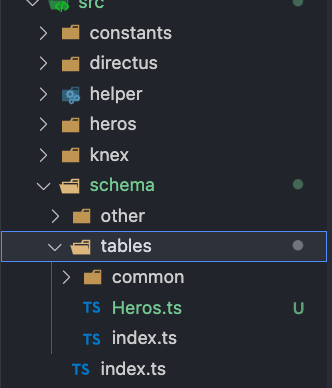
</div>

使用 `Table` 引用表，使用 `Column` 引用列

对主键列使用 `@Column ({ primary: true })`

更多参考：https://github.com/wwwouter/typed-knex
<div>
  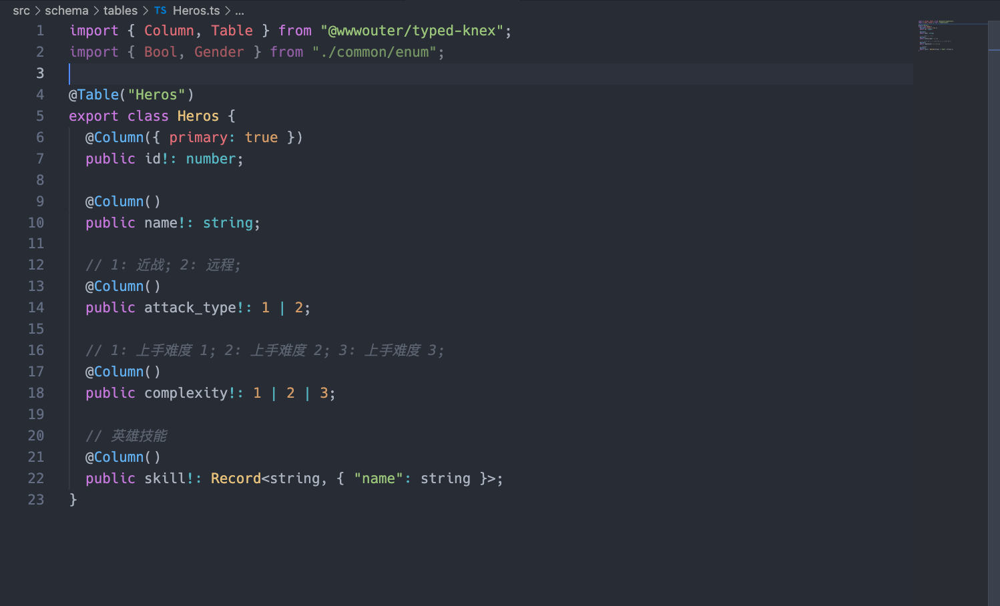
</div>

然后我们开始创建一个模块，这里我输入了 `heros` 作为模块名。 
<div>
  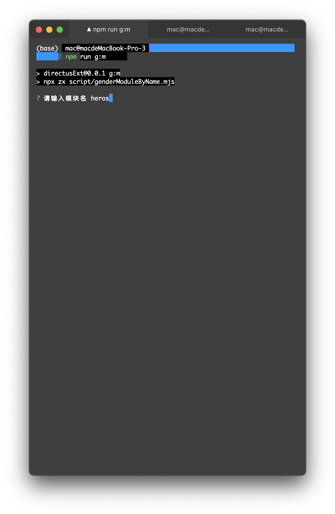
</div>

然后我们发现，`src` 目录下多了个 `heros` 目录。
<div>
  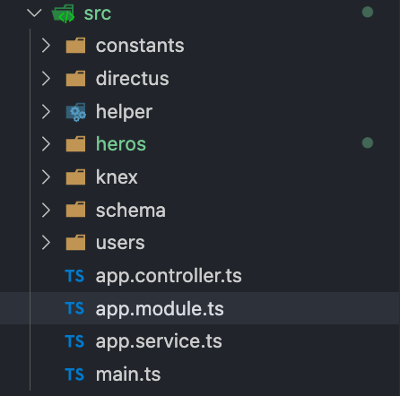
</div>

里面的所有 `.spec.ts` 文件为测试文件，可以删掉。
<div>
  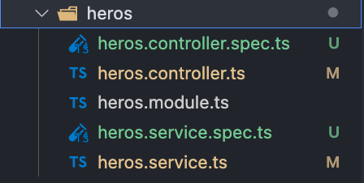
</div>

`controller.ts` 用于路由控制。

`module.ts` 用于建立当前模块关系。

`service.ts` 用于提供接口。

<br />

# `heros.controller.ts`

<div>
  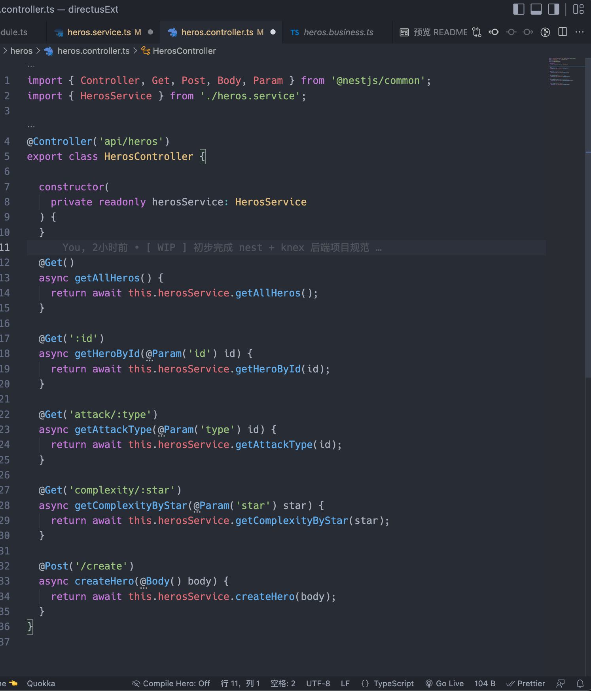
</div>

1. 可以使用 `@Controller` 装饰器定义接口的前缀。

2. 可以使用 `Get` 和 `Post` 定义接口的请求方式。 

3. 可以使用 `@Param()` 和 `@Body()` 定义接收参数。

<br />

# `heros.service.ts`

<div>
  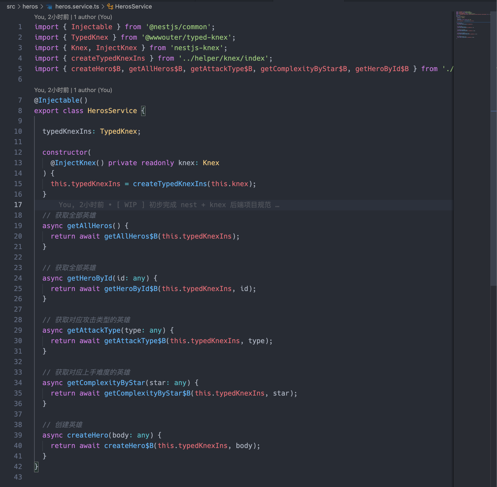
</div>

`Nest` 利用依赖注入，以 `.env` 文件的环境参数作为 `knex` 连接数据库的配置参数，在外面实例化后，注入进来。<br />
然后我们利用这个实例，实现具体的查询。

为了和 `directus` 扩展共享「校验」、「查询」等功能。我们决定在模块内部再加入两个文件，一个专门用于查询功能，一个用于校验和共享功能。

所以，我们新增了 `query.ts` 和 `business.ts`。<br />

<div>
  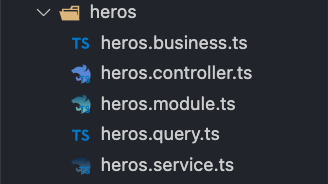
</div>

# `heros.query.ts`

<div>
  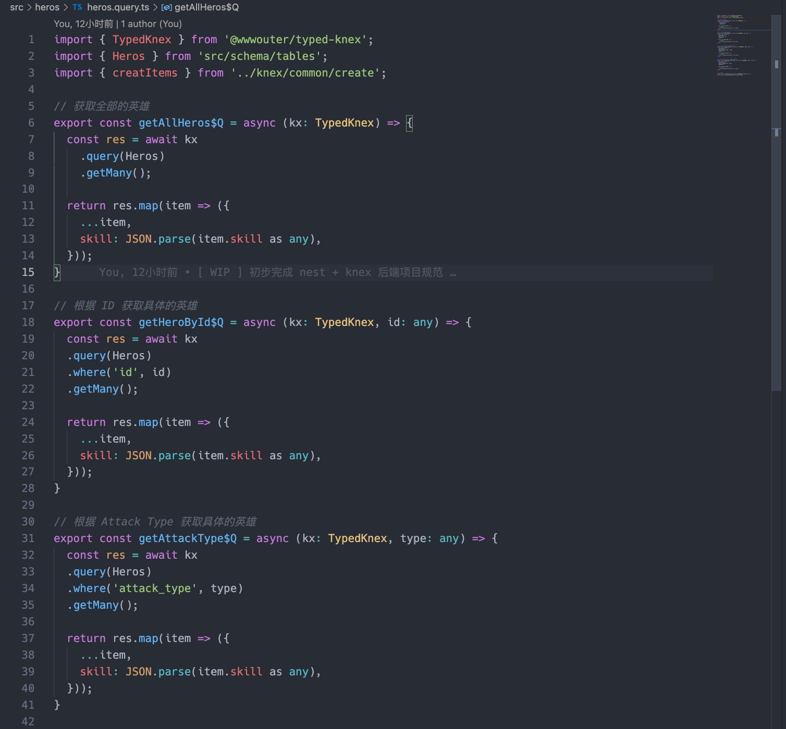
</div>

此文件专门放置 `Knex` 的查询和返回的数据过滤

`Tips`: 为了区分，后缀都为 `$Q`


# `heros.business.ts`

<div>
  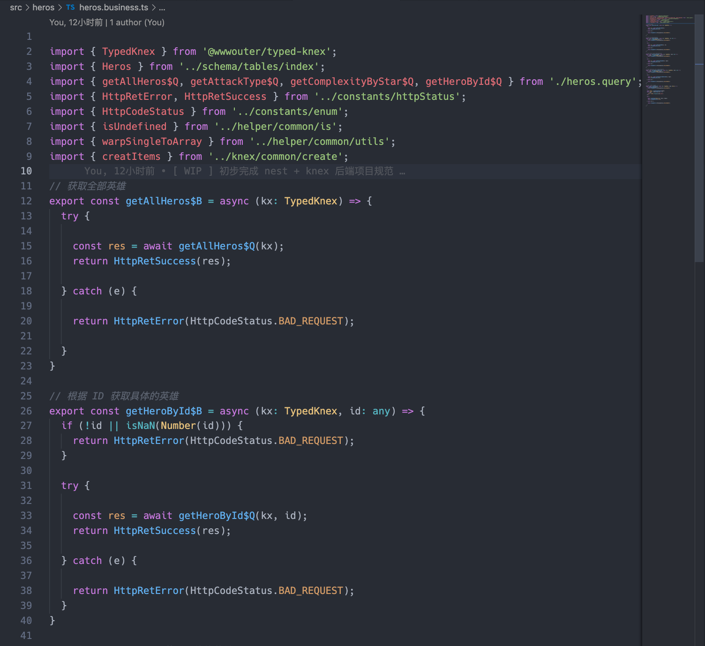
</div>

此文件专门做`「参数校验」`、`「错误处理」`、`「定义返回格式」`等

`Tips`: 为了区分，后缀都为 `$B`